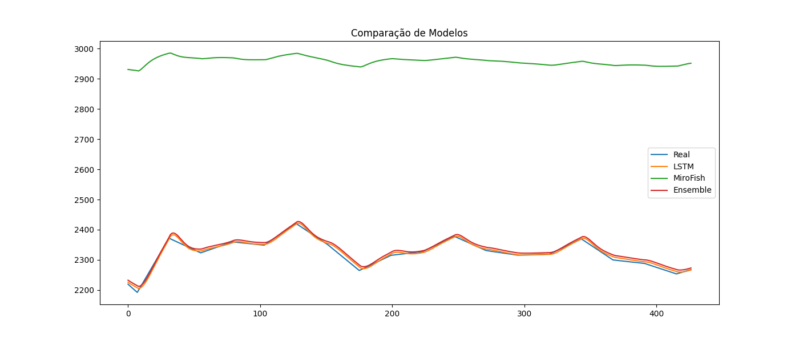
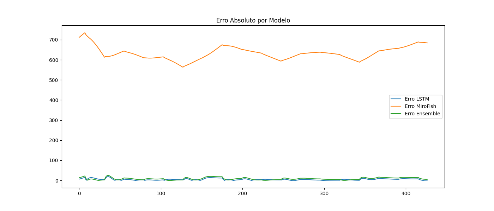
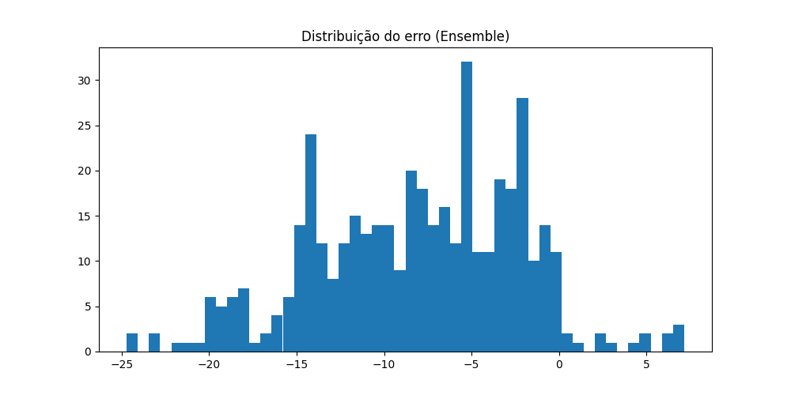

# Relatório Completo de Modelagem - Criptomoedas

## 1. Visão Geral
- Modelo LSTM (Deep Learning)
- Modelo MiroFish (custom NN)
- Ensemble ponderado

## 2. Dados
- Total de registros: 121
- Features utilizadas: ['price', 'volume', 'return_pct', 'moving_average', 'volatility']

## 3. Métricas

|          |       MAE |      RMSE |   MAPE (%) |
|:---------|----------:|----------:|-----------:|
| LSTM     |   4.88128 |   6.16196 |   0.210877 |
| MiroFish | 632.73    | 633.537   |  27.238    |
| Ensemble |   8.35539 |   9.96696 |   0.360843 |

## 4. Análise dos Modelos

### LSTM
- Boa capacidade de suavização
- Pode perder picos (lag)

### MiroFish
- Underfitting evidente
- Baixa sensibilidade ao movimento

### Ensemble
- Melhor equilíbrio entre viés e variância
- Redução de erro médio

## 5. Gráficos

### Comparação

### Erro

### Distribuição de erro

## 6. Diagnóstico Técnico

- LSTM: estável, mas suaviza demais
- MiroFish: não está aprendendo dinâmica temporal
- Ensemble: melhor resultado atual

## 7. Recomendações

- Aumentar epochs (>=30)
- Adicionar mais features (RSI, MACD)
- Ajustar arquitetura MiroFish
- Testar Transformer (próximo passo)
